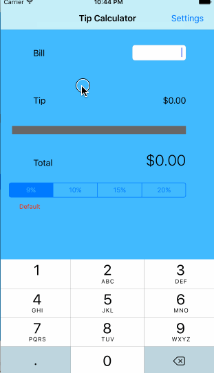

# ios_tip_calculator

Tip
==================

Tip Calculator app for CodePath

Time spent: 5 hours total

Completed user stories:

* [x] Required: Basic tip calculator functionatliy
* [x] Required: Settings page
* [x] Optional: Set default tip amount throguh view slider and show expression state on slider
* [x] Optional: View animation ( Total bill and tip numbers change with transition animation )
* [x] Optional: Remember the default tip across app restarts and load it
* [x] Optional: styling background, text type, size in main view
* [x] Optional: Launch keyboard as soon as app launches ( giving focus to ui text filed)
* [x] Optional: Created class for static method and constant

**Walkthrough of required and optional user stories:**

TODO :
- Give localization and use of different currency 
- Give bill/tip split feature 
